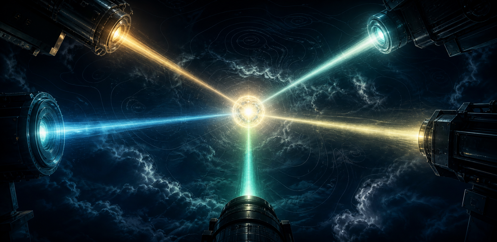
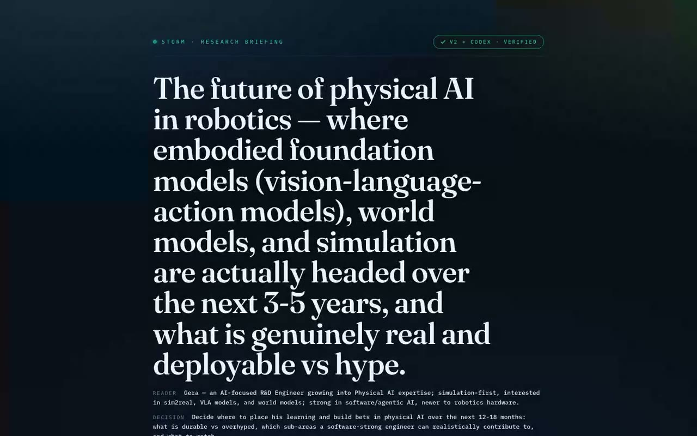

# STORM: a research method for our R&D work

*A method I've been exploring that turns Claude into a five-perspective research team, one that argues with itself and verifies its sources before it trusts an answer.*

**By Luis Gerardo Rodríguez García** (R&D Engineer) · co-authored with **Servy**, my agentic operating system.

> **Want the full experience?** This README is the readable version. For the interactive one, with the 60-second video and the live demo embedded, download the repo and open **`index.html`** in a browser.
>
> ▶ **[Watch the 60-second explainer](2026-06-29-storm-explainer.mp4)** &nbsp;·&nbsp; 🔎 **[See a real briefing it produced](physical-ai-briefing.html)**

---

## One prompt has one blind spot

When we research something, a new framework, a build-vs-buy call, whether a tool fits a client, we usually ask one question and get one angle. The model is tuned to agree with how we framed it. The questions we did not think to ask stay invisible, and we walk away confident about an answer that was never stress-tested.

STORM does the opposite. It researches the same topic from five expert perspectives at once, maps where they disagree, and checks every source before it trusts the answer.

## What STORM is

**STORM** (*Synthesis of Topic Outlines through Retrieval and Multi-perspective Question Asking*) is a peer-reviewed method from Stanford's OVAL lab (NAACL 2024). Its finding: researching a topic from many discovered perspectives, each asking its own questions, produces measurably more organized and broader coverage than a single pass. The real work happens *before* the writing, in how widely the topic gets interrogated.

I packaged that principle into a reusable Claude skill, so one command runs the whole pipeline and returns a briefing that always looks the same.

## How it works

You give it a topic and who the briefing is for. It runs four stages, then hands back a verified briefing:

1. **Five lenses** research the topic in parallel, each blind to the others.
2. A **contradiction map** finds where they disagree and which side has the stronger evidence.
3. **Synthesis** converges the angles into ranked findings, keeping the disagreements visible.
4. **Verification** checks every citation against its primary source. Confirmed, corrected, or demoted. V1 becomes V2.

### The five lenses

| Lens | What it catches |
|------|-----------------|
| **Practitioner** | What works in practice, what quietly breaks, what the docs never tell you |
| **Academic** | What the literature and benchmarks actually establish vs assume |
| **Skeptic** | The overclaims and failure modes; it assumes the hype is wrong |
| **Economist** | The cost, ROI, incentives, and what breaks at scale |
| **Historian** | Precedent and trajectory; what is genuinely new vs recycled |

The roster is the knob. Swap or add a seat per topic, a security lens for a vendor review, a client lens for a recommendation. The lens you forget is the one that bites.

## What you get back

Not a wall of text. A briefing with the trust on the surface:

- A **60-second summary**, aimed at the decision you are making
- **Findings ranked by reliability** (a 1 to 10 score from agreement under scrutiny, not an average)
- **The assumptions** it rests on, named explicitly
- **The missing lens**, the seat nobody sat in, with an offer to re-run with it added
- A **sources ledger**: every citation marked confirmed, corrected, or demoted

## See it in action

This is not a mockup. Here is a real briefing STORM produced, start to finish, on a genuine research question: **the future of physical AI in robotics**. Eleven findings, each ranked by reliability, every source checked, and a cross-model review (Codex) that demoted the overconfident ones.

▶ **[Watch the demo](2026-06-29-storm-demo.mp4)** &nbsp;·&nbsp; 🔎 **[Open the full briefing](physical-ai-briefing.html)**

## How we'd use it on real R&D work

The same shape as a lot of what we already do, just stress-tested:

- **Tool / framework evaluation** — *"Should we adopt &lt;tool&gt; for this engagement?"* → Practitioner · Skeptic · Economist + an Integrator seat. Catches the gap between the demo and your stack, and the hidden integration cost.
- **Build vs buy vs open-source** — *"What's the right way to get capability X?"* → Economist · Practitioner · Academic · Skeptic. Catches the true total cost of each path.
- **Maturity / readiness call** — *"Is &lt;emerging technique&gt; ready to recommend?"* → Academic · Skeptic · Practitioner + a Client seat. Separates a strong paper from a production-ready pattern, with citations verified.
- **Landscape scan / workshop prep** — *"Map the field before the architecture call."* → Historian · Academic · Practitioner · Economist. Surfaces what's been tried, what's new, and the framing question you'd otherwise miss.

## ⚠️ The data boundary (read this)

The lenses use **web search**, so your topic and queries leave the machine. This is a tool for **public, general research**: industry, tools, methods, markets, techniques.

For anything client-specific or internal, run it inside **SoftServe-approved tooling**, and never feed customer IP, code, or internal strategy into web-searching agents without the right approval. Same data-classification discipline we already apply everywhere else.

- ✅ **Good fit:** "Is this open-source framework production-ready?" · "How are teams doing X in 2026?" · "Compare these public tools."
- 🚫 **Not here:** anything carrying customer data, a client's architecture, internal roadmaps, or engagement specifics → approved tooling only.

## Trying it

It's a Claude Code skill: a short SOP file, a small workflow that fans out the agents, and a template that renders the briefing. The principle is portable to any agent setup. Pick a real, contested topic, frame the decision, tune the lens roster, and run it.

---

**Method:** STORM, five independent expert lenses → contradiction map → synthesis → adversarial citation verification (V1 → V2), with a cross-model final review.

**Sources:** Nate Herk, *"Stanford's Method Turns Claude Into a PHD Level Research Team"* (2026) · Stanford OVAL, **STORM** ([stanford-oval/storm](https://github.com/stanford-oval/storm), NAACL 2024).

*An internal share for the R&D team, 2026. Not a product pitch.*
